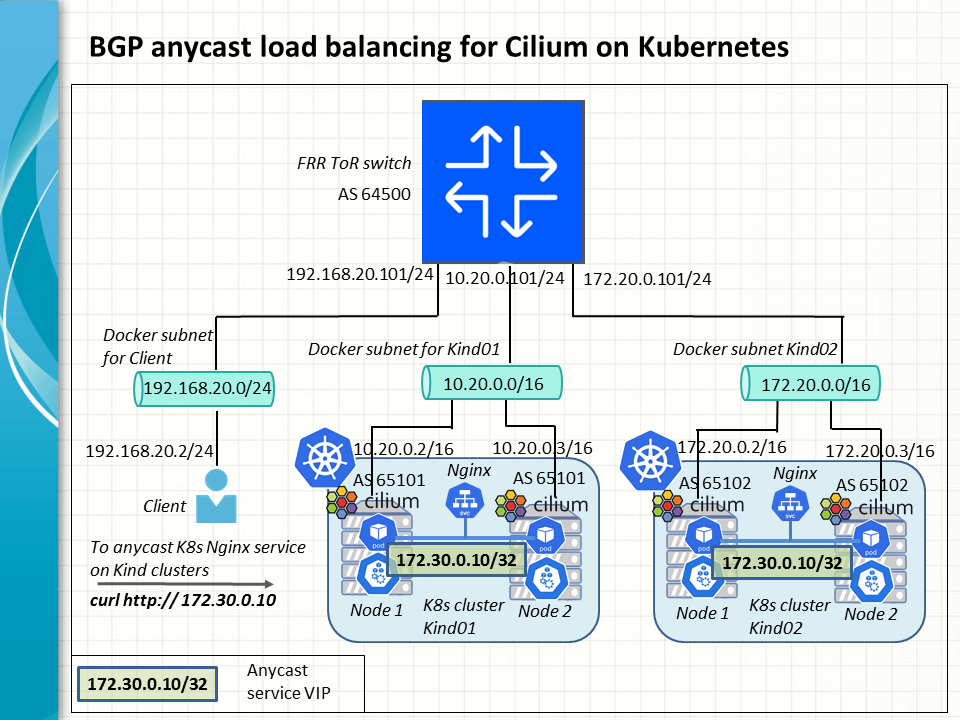

In this exercise, we will build and experiment with BGP anyscast routes that steer client requests to a service VIP advertised by the Cilium CNI provider from two Kubernetes clusters. The work will be carried out in a nifty but realistic emulation lab where all the assets including the FRR switch container and kind K8s clusters are deployed by hand.

### Why does it matter?

As Cilium is becoming the CNI of choice for Kubernetes, we hope to create a golden template for users to configure the Cilium BGP control plane in a standard way for Kubernetes service load balancing. It also caters for the configuration of an FRR router as a typical upstream BGP neigbour to interact with Cilium on two or more Kubernetes clusters. 

All in all, what we are going to do here is ready to extend to more sophisticated use cases of applying global server load balancing (GSLB) at scale to numerous Kubernetes services or ingress gateways that spring up on cloud or on premises nowadays.

### Lab inventory

Our lab provides an emulation enviroment for the docker resources below to constitute the underlying topology. All of them are deployed by hand on an Ubuntu VM host.

<table>
	<thead>
		<tr>
			<th scope="col">Topology Node</th>
			<th scope="col">Docker Type</th>
			<th scope="col">Network Configuration</th>
			<th scope="col">Creation</th>
		</tr>
	</thead>
	<tbody>
		<tr>
			<td aligh="left">Client workstation</td>
			<td aligh="left">Container</td>
			<td aligh="left">192.168.20.2/24</td>
			<td aligh="left">docker run</td>
		</tr>
        <tr>
			<td aligh="left">Client docker subnet</td>
			<td aligh="left">Network</td>
			<td aligh="left">192.168.20.0/24</td>
			<td aligh="left">docker network create</td>
		</tr>
		<tr>
			<td aligh="left">FRR tor switch</td>
			<td aligh="left">Container</td>
			<td aligh="left">192.168.20.101/24 <br>
                10.20.0.101/16 <br>
				172.20.0.101/16 <br>
				BGP ASN: 65001
			</td>
			<td aligh="left">docker run</td>
		</tr>
        <tr>
			<td aligh="left">Kind01 K8s cluster node 1</td>
			<td aligh="left">Container</td>
			<td aligh="left">10.20.0.2/16</td>
			<td aligh="left">kind create cluster</td>
		</tr>
		<tr>
			<td aligh="left">Kind01 K8s cluster node 2</td>
			<td aligh="left">Container</td>
			<td aligh="left">10.20.0.3/16</td>
			<td aligh="left">kind create cluster</td>
		</tr>
		 <tr>
			<td aligh="left">Kind01 docker subnet</td>
			<td aligh="left">Network</td>
			<td aligh="left">10.20.0.0/16</td>
			<td aligh="left">docker network create</td>
		</tr>
		 <tr>
			<td aligh="left">Kind02 K8s cluster node 1</td>
			<td aligh="left">Container</td>
			<td aligh="left">172.20.0.2/16</td>
			<td aligh="left">kind create cluster</td>
		</tr>
		<tr>
			<td aligh="left">Kind02 K8s cluster node 2</td>
			<td aligh="left">Container</td>
			<td aligh="left">172.20.0.3/16</td>
			<td aligh="left">kind create cluster</td>
		</tr>
		 <tr>
			<td aligh="left">Kind02 docker subnet</td>
			<td aligh="left">Network</td>
			<td aligh="left">172.20.0.0/16</td>
			<td aligh="left">kind create cluster</td>
		</tr>
  </tbody>
</table>

### 1. Deploy the Kind Kubernetes clusters

The lab is assumed to take place in a Ubuntu 22.04 VM host on VirtualBox in our example. <br>
Install the Kind binaries on the host.
```
sudo sysctl -w fs.inotify.max_user_watches=524288
sudo sysctl -w fs.inotify.max_user_instances=512

curl -LO "https://dl.k8s.io/release/$(curl -L -s https://dl.k8s.io/release/stable.txt)/bin/linux/amd64/kubectl"
sudo install -o root -g root -m 0755 kubectl /usr/local/bin/kubectl
[ $(uname -m) = x86_64 ] && curl -Lo ./kind https://kind.sigs.k8s.io/dl/v0.30.0/kind-linux-amd64
chmod u+x ./kind
cp -p ./kind /usr/local/bin
```

Create a docker subnet named kind01 with a cidr of 10.20.0.0/16. <br>
Set the environment variable KIND_EXPERIMENTAL_DOCKER_NETWORK to kind01 to instruct kind to create the first Kubernetes cluster called kind01 on the the user defined subnet 10.20.0.0/16
```
docker network create --subnet=10.20.0.0/16 kind01
export KIND_EXPERIMENTAL_DOCKER_NETWORK=kind01
kind create cluster --config=- <<EOF
kind: Cluster
apiVersion: kind.x-k8s.io/v1alpha4
name: kind01
nodes:
 - role: control-plane
 - role: worker
EOF
```

Perform post-deployment routines on the kind cluster nodes by adding the return routes for the client network and installing auxilliary utilities.
```
docker exec kind01-control-plane ip route add 192.168.20.0/24 via 10.20.0.101 dev eth0
docker exec kind01-worker ip route add 192.168.20.0/24 via 10.20.0.101 dev eth0

docker exec kind01-control-plane bash -c "apt-get update && apt-get install iputils-ping"
docker exec kind01-worker bash -c "apt-get update && apt-get install iputils-ping"
```

After installation, the kubectl context points to the newly created Kubernetes cluster, kind01.
```
keyuser@ubunclone:~/BGP_Anycast_Cilium_SLB$ kubectl config current-context
kind-kind01
keyuser@ubunclone:~/BGP_Anycast_Cilium_SLB$ kubectl get nodes -o wide
NAME                   STATUS   ROLES           AGE     VERSION   INTERNAL-IP   EXTERNAL-IP   OS-IMAGE                         KERNEL-VERSION       CONTAINER-RUNTIME
kind01-control-plane   Ready    control-plane   8m17s   v1.34.0   10.20.0.3     <none>        Debian GNU/Linux 12 (bookworm)   5.15.0-156-generic   containerd://2.1.3
kind01-worker          Ready    <none>          7m51s   v1.34.0   10.20.0.2     <none>        Debian GNU/Linux 12 (bookworm)   5.15.0-156-generic   containerd://2.1.3
keyuser@ubunclone:~/BGP_Anycast_Cilium_SLB$
```

Similarly use kind to create the second Kubernetes cluster called kind02 on the the user defined subnet 172.20.0.0/16.
```
keyuser@ubunclone:~/BGP_Anycast_Cilium_SLB$ kubectl config current-context
kind-kind02
keyuser@ubunclone:~/BGP_Anycast_Cilium_SLB$ kubectl get nodes -o wide
NAME                   STATUS   ROLES           AGE     VERSION   INTERNAL-IP   EXTERNAL-IP   OS-IMAGE                         KERNEL-VERSION       CONTAINER-RUNTIME
kind02-control-plane   Ready    control-plane   2m32s   v1.34.0   172.20.0.2    <none>        Debian GNU/Linux 12 (bookworm)   5.15.0-156-generic   containerd://2.1.3
kind02-worker          Ready    <none>          2m12s   v1.34.0   172.20.0.3    <none>        Debian GNU/Linux 12 (bookworm)   5.15.0-156-generic   containerd://2.1.3
```

### 2. Install Cilum in Kubernetes

Before installation, it is necessary to remove the default CNI that comes with kind together with the kube-proxy and kindnet daemon sets.
```
kubectl delete daemonset -n kube-system kube-proxy
kubectl delete daemonset -n kube-system kindnet
docker exec kind01-control-plane rm -rf /etc/cni/net.d/*
docker exec kind01-worker rm -rf /etc/cni/net.d/*
```

Install Cilium in both K8s clusters with the desirable settings. In particular, the flag bgpControlPlane.enabled=true indicates the Cilium BGP control plane will be enabled upon installation.
```
CILIUM_CLI_VERSION=$(curl -s https://raw.githubusercontent.com/cilium/cilium-cli/main/stable.txt)
CLI_ARCH=amd64
if [ "$(uname -m)" = "aarch64" ]; then CLI_ARCH=arm64; fi
curl -L --fail --remote-name-all https://github.com/cilium/cilium-cli/releases/download/${CILIUM_CLI_VERSION}/cilium-linux-${CLI_ARCH}.tar.gz{,.sha256sum}
sha256sum --check cilium-linux-${CLI_ARCH}.tar.gz.sha256sum
sudo tar xzvfC cilium-linux-${CLI_ARCH}.tar.gz /usr/local/bin
rm cilium-linux-${CLI_ARCH}.tar.gz{,.sha256sum}

cilium install \
  --set kubeProxyReplacement="true" \
  --set routingMode="native" \
  --set ipv4NativeRoutingCIDR="10.244.0.0/16" \
  --set bgpControlPlane.enabled=true \
  --set l2NeighDiscovery.enabled=true \
  --set l2announcements.enabled=true \
  --set l2podAnnouncements.enabled=true \
  --set externalIPs.enabled=true \
  --set autoDirectNodeRoutes=true \
  --set operator.replicas=2
```

Check the installation completed OK and Cilium has taken over each cluster.
```
keyuser@ubunclone:~/BGP_Anycast_Cilium_SLB$ cilium status
    /¯¯\
 /¯¯\__/¯¯\    Cilium:             OK
 \__/¯¯\__/    Operator:           OK
 /¯¯\__/¯¯\    Envoy DaemonSet:    OK
 \__/¯¯\__/    Hubble Relay:       disabled
    \__/       ClusterMesh:        disabled

DaemonSet              cilium                   Desired: 2, Ready: 2/2, Available: 2/2
DaemonSet              cilium-envoy             Desired: 2, Ready: 2/2, Available: 2/2
Deployment             cilium-operator          Desired: 2, Ready: 2/2, Available: 2/2
Containers:            cilium                   Running: 2
                       cilium-envoy             Running: 2
                       cilium-operator          Running: 2
                       clustermesh-apiserver
                       hubble-relay
Cluster Pods:          4/5 managed by Cilium
Helm chart version:    1.18.3
Image versions         cilium             quay.io/cilium/cilium:v1.18.3@sha256:5649db451c88d928ea585514746d50d91e6210801b300c897283ea319d68de15: 2
                       cilium-envoy       quay.io/cilium/cilium-envoy:v1.34.10-1761014632-c360e8557eb41011dfb5210f8fb53fed6c0b3222@sha256:ca76eb4e9812d114c7f43215a742c00b8bf41200992af0d21b5561d46156fd15: 2
                       cilium-operator    quay.io/cilium/operator-generic:v1.18.3@sha256:b5a0138e1a38e4437c5215257ff4e35373619501f4877dbaf92c89ecfad81797: 2
keyuser@ubunclone:~/BGP_Anycast_Cilium_SLB$
keyuser@ubunclone:~/BGP_Anycast_Cilium_SLB$ kubectl -n kube-system get pods
NAME                                           READY   STATUS    RESTARTS   AGE
cilium-42gvd                                   1/1     Running   0          27m
cilium-792kd                                   1/1     Running   0          27m
cilium-envoy-dqppr                             1/1     Running   0          27m
cilium-envoy-hwbwr                             1/1     Running   0          27m
cilium-operator-686595b9d4-hnmpw               1/1     Running   0          27m
cilium-operator-686595b9d4-mt7sm               1/1     Running   0          27m
coredns-66bc5c9577-vwkmq                       1/1     Running   0          26m
coredns-66bc5c9577-zfjh6                       1/1     Running   0          26m
etcd-kind01-control-plane                      1/1     Running   0          28m
kube-apiserver-kind01-control-plane            1/1     Running   0          28m
kube-controller-manager-kind01-control-plane   1/1     Running   0          28m
kube-scheduler-kind01-control-plane            1/1     Running   0          28m
```

### 3. Deploy FRR switch

Deploy an FRR switch container go perform the role of a so-called top of the rack router and forward traffic between the two kind clusters and client.
In this example, the switch is connected to the following IP subnets.
* client: 192.168.20.0/24
* kind01: 10.20.0.0/16
* kind02: 172.20.0.0/16
  
```
#!/bin/bash

docker network create --subnet=192.168.20.0/24 client
docker run -d --init --privileged --name frrtor \
-v ./configure/frrtor.conf:/etc/frr/frr.conf \
-v ./configure/frrdaemons:/etc/frr/daemons \
-v ./configure/vtysh.conf:/etc/frr/vtysh.conf \
--network client --ip 192.168.20.101 \
frrouting/frr:latest

docker network connect --ip 10.20.0.101 kind01 frrtor
docker network connect --ip 172.20.0.101 kind02 frrtor

docker exec frrtor sh -c "sysctl -w net.ipv4.ip_forward=1 && sysctl -w net.ipv4.fib_multipath_hash_policy=1"
docker exec frrtor vtysh -c "show interface && show running-config"
docker exec frrtor vtysh -c "show bgp summary && show ip bgp && show ip route"
```

The FRR switch is configured by virtue of these files mounted on /etc/frr within the container.
* [configure/frrtor.conf](configure/frrtor.conf)
* [configure/frrdaemons](configure/frrdaemons)
* [configure/vtysh.conf](configure/vtysh.conf)

In particular, it is important to set the following bgp features as per [frrtor.conf](configure/frrtor.conf), which are pivotal to the adoption of ECMP routes.
```
bgp bestpath as-path multipath-relax
...
maximum-paths 10
```

The first line means that the switch will treat two or more BGP routes whose AS paths are of the same length as equal-cost routes. In our example, the AS path of the BGP route to the anycast VIP on the kind01 cluster is "65101 i", while the BGP route to the anycast VIP on kind02 takes the AS path "65102 i". The routes are considered equal in cost as both are two ASNs long.

The second line indicates that the switch will install a maximum of 10 equal-cost routes as ECMP routes.
